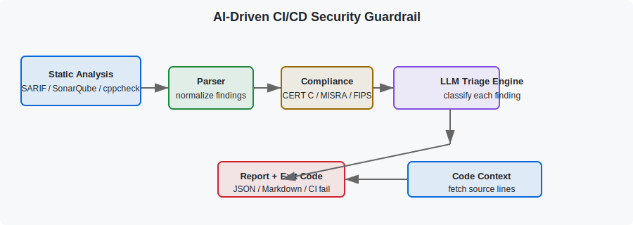

# AI-Driven CI/CD Security Guardrail

> Context-aware triage of static-analysis findings for C/C++ using a Large Language Model.

[](https://github.com/samueladegnan/ai-cicd-security-guardrail/actions/workflows/guardrail.yml)
[](https://www.python.org/)
[](https://opensource.org/licenses/MIT)

## What It Is

The **AI-Driven CI/CD Security Guardrail** is a Python CLI and reusable GitHub Action that ingests static-analysis reports for C/C++ code, enriches each finding with source context and compliance mappings, and uses an LLM to classify findings as **High-Priority Security Risk**, **False Positive**, or **Unclear**. It returns a CI-friendly exit code so that real risks can fail a build while false positives are filtered out.

This project was built as a **portfolio piece** to demonstrate:

- Secure software engineering and compliance awareness.
- DevOps / CI/CD automation with GitHub Actions and Docker.
- LLM integration with provider-agnostic abstractions.
- Clean Python architecture, testing, and packaging.

## How It Works



1. **Ingest** — Parse SARIF, SonarQube JSON, or cppcheck XML reports.
2. **Enrich** — Load the relevant C/C++ source code around each finding.
3. **Map** — Map CWEs to controls in **CERT C**, **MISRA C**, and **FIPS 140-3**.
4. **Classify** — Send code context to an LLM (OpenAI, Anthropic, Gemini, or a deterministic mock).
5. **Report** — Produce JSON and Markdown reports and a non-zero exit code for real risks.

## Live Demo

Run the guardrail with the built-in mock provider — no API key required.

```bash
docker build -t ai-guardrail .
docker run --rm -v "$(pwd):/workspace" --workdir /workspace ai-guardrail \
  tests/fixtures/sample.sarif \
  --repo-root /workspace \
  --output-markdown /workspace/report.md
```

See the full [Demo Walkthrough](./demo) for local installation, CLI usage, CI/CD examples, and expected outputs.

## Key Features

- **Multi-format parser support:** SARIF, SonarQube JSON, cppcheck XML.
- **Compliance-aware context:** CERT C, MISRA C:2012, and FIPS 140-3 controls.
- **Provider-agnostic LLM layer:** OpenAI, Anthropic, Gemini, and zero-cost mock provider.
- **CI/CD ready:** Docker container, reusable GitHub Action, and Jenkins pipeline example.
- **Fast feedback:** In-memory caching and controlled concurrency.

## Architecture

For a detailed data-flow diagram, component breakdown, and extensibility guide, see [Architecture](./architecture).

## Project Links

- [Source Code](https://github.com/samueladegnan/ai-cicd-security-guardrail)
- [README](https://github.com/samueladegnan/ai-cicd-security-guardrail#readme)
- [Demo Walkthrough](./demo)
- [Architecture Deep Dive](./architecture)

## About the Author

Built by [Sam Degnan](https://github.com/samueladegnan) as a portfolio project to demonstrate DevOps, secure coding, compliance mapping, and AI-assisted software engineering.
